# Integration Guide: Trae-Proxy with Nginx-Proxy-Manager

## The Problem in Simple Terms

Imagine you have two doors, but both need to use the same doorway. That's the situation here:

- **Nginx-Proxy-Manager (NPM)** is already using port 443 (the main HTTPS doorway) for all your websites
- **Trae-Proxy** also wants port 443 to intercept OpenAI API requests

This guide shows you how to make them work together using a simple solution: **Use your own domain name instead of pretending to be OpenAI**.

---

## The Solution: Use Your Own Domain (Subdomain Approach)

Instead of faking `api.openai.com` (which requires complicated certificate stuff), we'll use your own domain like:

```
openai-proxy.yourdomain.com
```

### Why This Is Better

| Approach | Complicated? | Real SSL Certificate? | Client Setup |
|----------|-------------|----------------------|--------------|
| Old way (api.openai.com) | Very complicated | No (self-signed) | Need to install certificates manually |
| **New way (your own domain)** | Simple | Yes (Let's Encrypt) | Just change the URL in your IDE |

---

## How It Works (Visual Overview)


### What's Happening Here?

1. **Your IDE** sends a request to `openai-proxy.yourdomain.com` (your own domain!)
2. **Nginx-Proxy-Manager** receives it (it's already handling port 443 for everything else)
3. **NPM** forwards the request to **Trae-Proxy** running on port 8443 (internal)
4. **Trae-Proxy** routes it to the actual API (DeepSeek, Kimi, etc.)
5. The response flows back through the same path

---

## Step-by-Step Setup Guide

### Prerequisites

You already have:
- A domain name (e.g., `yourdomain.com`)
- Nginx-Proxy-Manager running on port 443
- Trae-Proxy files ready to deploy

---

### Step 1: Configure Trae-Proxy to Use Port 8443

We need to change Trae-Proxy from port 443 to port 8443, and make it **HTTP only** (not HTTPS). This is safe because Nginx will handle the HTTPS part.

#### Edit `docker-compose.yml`

Change the port mapping:

```yaml
# BEFORE (old way)
ports:
  - "443:443"

# AFTER (new way)
ports:
  - "127.0.0.1:8443:8443"  # Only accessible from localhost
```

**What does `127.0.0.1:8443:8443` mean?**
- The first `127.0.0.1:8443` means "only accept connections from this machine"
- The second `8443` is the port inside the Docker container
- This makes Trae-Proxy **not directly accessible from the internet** - only through Nginx!

#### Edit `trae_proxy.py` (if needed)

Find the line that starts the server (around line 403) and change it to:

```python
# BEFORE (old HTTPS way)
app.run(host='0.0.0.0', port=443, ssl_context=(cert_file, key_file), threaded=True)

# AFTER (new HTTP way)
app.run(host='0.0.0.0', port=8443, threaded=True)
```

#### Start Trae-Proxy

```bash
cd /path/to/Trae-Proxy
docker-compose up -d
```

---

### Step 2: Configure Nginx-Proxy-Manager

Now we tell Nginx-Proxy-Manager to handle `openai-proxy.yourdomain.com` and forward it to Trae-Proxy.

#### Via Web UI (Easiest Way)

1. **Open NPM Dashboard**
   - Go to `https://your-server-ip:81`
   - Login with your credentials

2. **Add a New Proxy Host**
   - Click **"Proxy Hosts"** in the left menu
   - Click **"Add Proxy Host"** button

3. **Fill in the Form:**

   | Field | What to Enter |
   |-------|---------------|
   | **Domain Names** | `openai-proxy.yourdomain.com` (replace with your actual domain) |
   | **Scheme** | `https` |
   | **Forward Hostname/IP** | `trae-proxy` (or the Docker container name) |
   | **Forward Port** | `8443` |
   | **Cache Assets** | ❌ (unchecked) |
   | **Block Common Exploits** | ✅ (checked) |

4. **SSL Certificate** (This is the best part!)
   - Click on the **SSL** tab
   - Select **"Request a new SSL Certificate"**
   - Select **"Let's Encrypt"**
   - ✅ **Force SSL** - Checked
   - ✅ **HTTP/2 Support** - Checked
   - ✅ **HSTS Enabled** - Checked
   - Click **Save**

   NPM will automatically get a **real, trusted SSL certificate** for your domain!

5. **Done!** Click **Save** to create the proxy host.

#### Important Note for Docker Networking

If Nginx and Trae-Proxy are in different Docker networks, you may need to:

1. Put both containers on the same network
2. Or use the actual IP address instead of the container name

To check if they can communicate:
```bash
# From inside the nginx container
docker exec -it nginx ping trae-proxy
```

---

### Step 3: Configure Your IDE

Now you just need to tell your IDE to use your new proxy URL.

#### For Trae IDE (and similar IDEs)

When adding a custom model:

| Setting | Value |
|---------|-------|
| **Provider** | OpenAI (or Custom, depending on IDE) |
| **Base URL** | `https://openai-proxy.yourdomain.com` |
| **Model ID** | Whatever you configured in Trae-Proxy (e.g., `deepseek-reasoner`, `qwen3-coder-plus`) |
| **API Key** | Your backend API key (e.g., DeepSeek API key) |

#### No More Hosts File or Certificates!

With this approach:
- ❌ No need to edit `/etc/hosts` file
- ❌ No need to install self-signed certificates
- ✅ Just use the URL `https://openai-proxy.yourdomain.com`

---

### Step 4: Test It

Open a terminal and test:

```bash
curl https://openai-proxy.yourdomain.com/v1/models \
  -H "Authorization: Bearer YOUR_API_KEY"
```

If everything is working, you should see a list of available models.

---

## Comparison: Old Way vs New Way


---

## Security: Is This Safe?

**Yes!** Here's why:

| Concern | Why It's Safe |
|---------|---------------|
| **Trae-Proxy uses HTTP internally** | It's on `127.0.0.1` (localhost only) - the internet can't reach it directly |
| **Data is encrypted** | Nginx handles HTTPS between client and server |
| **Backend connections are encrypted** | Trae-Proxy still uses HTTPS when talking to backend APIs (DeepSeek, etc.) |

Think of it like this:
- The secure tunnel (HTTPS) is between your computer and Nginx
- Inside your server, data travels a short distance in plain text
- Then it goes back into a secure tunnel to the backend API

This is how most modern web applications work!

---

## Quick Reference Card

```mermaid
flowchart TD
    A[Start] --> B{Do you have a domain?}
    B -->|Yes| C[Configure Trae-Proxy on port 8443]
    B -->|No| D[Get a domain first!<br/>e.g., from Namecheap, Cloudflare]

    C --> E[Add proxy host in NPM<br/>openai-proxy.yourdomain.com]
    E --> F[Enable Let's Encrypt SSL in NPM]
    F --> G[Configure IDE to use<br/>https://openai-proxy.yourdomain.com]
    G --> H[Test with curl command]
    H --> I{Working?}
    I -->|Yes| J[Done! 🎉]
    I -->|No| K[Check Docker networking<br/>and port forwarding]

    style A fill:#e3f2fd
    style J fill:#c8e6c9
    style K fill:#ffcdd2
```



---

## Troubleshooting

### Problem: "502 Bad Gateway"

**What it means:** Nginx can't reach Trae-Proxy

**Solutions:**
1. Check if Trae-Proxy is running:
   ```bash
   docker ps | grep trae-proxy
   ```

2. Check if Nginx container can reach Trae-Proxy:
   ```bash
   docker exec -it nginx ping trae-proxy
   ```

3. Make sure both containers are on the same Docker network:
   ```bash
   docker network ls
   docker network inspect nginx_bridges
   ```

### Problem: "SSL Certificate Error"

**What it means:** Let's Encrypt couldn't verify your domain

**Solutions:**
1. Make sure `openai-proxy.yourdomain.com` points to your server IP (DNS A record)
2. Wait a few minutes for DNS to propagate
3. Check that port 80 is open (Let's Encrypt uses it for validation)

### Problem: "Connection Refused"

**What it means:** Trae-Proxy isn't listening on port 8443

**Solutions:**
1. Check Trae-Proxy logs:
   ```bash
   docker logs trae-proxy
   ```

2. Verify port configuration in `docker-compose.yml`

---

## File Changes Summary

| File | What to Change |
|------|----------------|
| `Trae-Proxy/docker-compose.yml` | Change port from `443:443` to `127.0.0.1:8443:8443` |
| `Trae-Proxy/trae_proxy.py` | Change server to HTTP mode on port 8443 (remove SSL context) |
| Nginx-Proxy-Manager | Add proxy host: `openai-proxy.yourdomain.com` → `trae-proxy:8443` |

---

## Why This Approach is Recommended

1. **Simpler** - No certificate installation on clients
2. **More Secure** - Uses real SSL certificates from Let's Encrypt
3. **Cleaner** - Uses your own domain (you own it!)
4. **More Flexible** - Easy to add more subdomains later
5. **Standard Practice** - This is how real-world applications work

---

## FAQ

**Q: Can I still use this if my IDE doesn't support custom base URLs?**

A: Unfortunately, no. That's the main reason the original Trae-Proxy used the `api.openai.com` approach. Check your IDE's documentation for "custom API endpoint" or "base URL" support.

**Q: Do I need to open port 8443 in my firewall?**

A: No! In fact, you should block it. Port 8443 is only for internal communication between Nginx and Trae-Proxy on the same machine.

**Q: Can I use multiple Trae-Proxy instances?**

A: Yes! Just use different subdomains:
- `openai-proxy-1.yourdomain.com` → Trae-Proxy instance 1
- `openai-proxy-2.yourdomain.com` → Trae-Proxy instance 2

**Q: What happens if I want to use the original api.openai.com approach later?**

A: You can always switch back. Just revert the port changes to `443:443` and use the self-signed certificate method.

---

**Document Version:** 2.0 (Subdomain Approach)
**Last Updated:** 2026-01-06